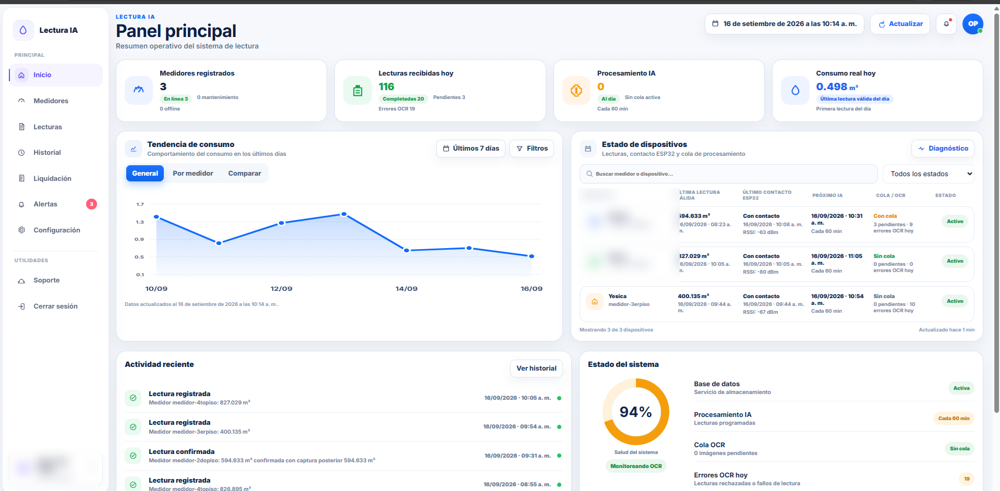
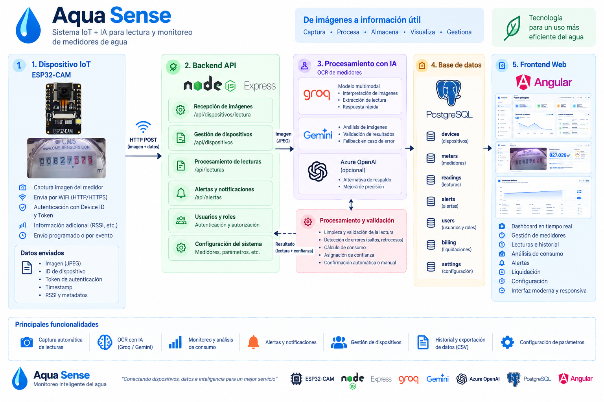
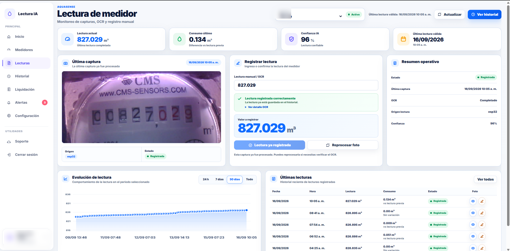
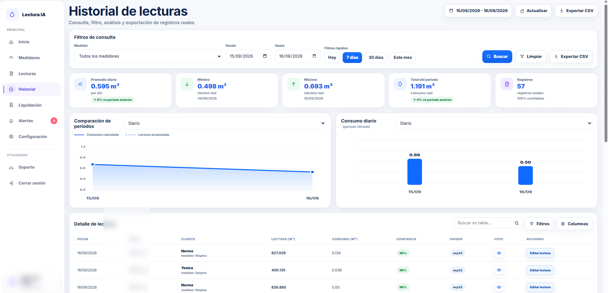

# 💧 Aqua Sense

### Sistema IoT + IA para lectura y monitoreo de medidores de agua


Aqua Sense es un proyecto personal **end-to-end** que integra IoT, backend, inteligencia artificial y desarrollo web para automatizar la captura, interpretación, almacenamiento y visualización de lecturas de medidores de agua.

> 🔒 **Código fuente privado:** este repositorio es la presentación pública del proyecto. El backend, frontend y firmware del dispositivo se mantienen en repositorios privados.

---

## 📸 Vista general



El sistema permite monitorear dispositivos, procesar lecturas, analizar consumo y consultar el historial desde una aplicación web.

---

## 🎯 Objetivo

Automatizar la lectura y monitoreo de medidores mediante:

- 📷 Captura de imágenes con ESP32-CAM.
- 📡 Comunicación entre dispositivos IoT y backend.
- 🤖 Interpretación de imágenes mediante IA/OCR.
- 🔎 Validación de las lecturas obtenidas.
- 🗄️ Almacenamiento de información en PostgreSQL.
- 📊 Análisis histórico del consumo.
- 🚨 Gestión de alertas.
- 🖥️ Dashboard web para monitoreo.

---

## 🏗️ Arquitectura

Aqua Sense está organizado en cinco componentes principales:

1. **ESP32-CAM** — captura imágenes del medidor.
2. **Node.js + Express** — API REST y lógica del sistema.
3. **IA/OCR** — interpretación de las capturas.
4. **PostgreSQL** — persistencia de dispositivos, lecturas y datos asociados.
5. **Angular** — interfaz web de monitoreo y gestión.



---

## 🔄 Flujo de una lectura

```text
📷 ESP32-CAM
     │
     │ Imagen + datos del dispositivo
     ▼
⚙️ Node.js + Express
     │
     ▼
🤖 IA / OCR
     │
     ▼
🔎 Validación
     │
     ▼
🗄️ PostgreSQL
     │
     ▼
🅰️ Angular
```

### Proceso

1. El ESP32-CAM captura una imagen del medidor.
2. El dispositivo envía la captura al backend.
3. Node.js + Express recibe y registra la información.
4. La imagen es procesada mediante IA/OCR.
5. El resultado es validado antes de registrarse.
6. La lectura se almacena en PostgreSQL.
7. Angular consume la API y presenta la información.

---

## 🤖 IA / OCR

Aqua Sense utiliza procesamiento multimodal para interpretar imágenes de medidores.

### Proveedores integrados

- **Groq**
- **Gemini**

El procesamiento se realiza desde el backend y las credenciales se gestionan mediante variables de entorno.

La lectura obtenida pasa por una etapa de validación antes de considerarse válida.

---

## 🔎 Validación de lecturas

El sistema incorpora lógica para detectar posibles inconsistencias en los resultados obtenidos mediante IA/OCR.

Entre los controles implementados se encuentran:

- Nivel de confianza.
- Comparación con lecturas anteriores.
- Detección de saltos anómalos.
- Detección de retrocesos.
- Variaciones de consumo.
- Confirmación de lecturas.
- Revisión o corrección manual.

```text
Imagen
  ↓
IA / OCR
  ↓
Lectura detectada
  ↓
Validación
  ↓
Lectura registrada
```

---

## 📷 ESP32-CAM

El ESP32-CAM funciona como dispositivo de captura.

Una captura puede estar asociada con:

- Imagen JPEG.
- Device ID.
- Device Token.
- Timestamp.
- RSSI.
- Metadatos del dispositivo.

El backend identifica y valida los dispositivos autorizados antes de procesar sus datos.

---

## 🖥️ Dashboard

El dashboard presenta una vista general del estado operativo del sistema.

Incluye:

- Medidores registrados.
- Lecturas recibidas.
- Procesamiento IA.
- Consumo.
- Tendencias.
- Estado de dispositivos.
- Actividad reciente.
- Estado general del sistema.


---

## 📖 Lectura del medidor

La sección de lecturas permite consultar la captura procesada y el resultado obtenido.

Incluye:

- Imagen del medidor.
- Lectura actual.
- Consumo respecto a la lectura anterior.
- Confianza de IA.
- Fecha y hora.
- Estado de procesamiento.
- Origen de la lectura.
- Evolución histórica.



---

## 📊 Historial y análisis

El sistema mantiene un historial de lecturas para analizar el consumo.

Incluye:

- Filtros por medidor.
- Filtros por fecha.
- Promedio diario.
- Mínimo y máximo.
- Consumo total.
- Gráficos.
- Tabla detallada.
- Nivel de confianza.
- Origen de la lectura.
- Exportación CSV.



---

## ✨ Funcionalidades principales

| Funcionalidad | Descripción |
|---|---|
| 📷 Captura automática | Captura de imágenes mediante ESP32-CAM |
| 🤖 IA / OCR | Interpretación automática de imágenes |
| 🔎 Validación | Control de consistencia de lecturas |
| 📡 Dispositivos | Gestión de dispositivos IoT |
| 📊 Dashboard | Resumen operativo del sistema |
| 💧 Consumo | Cálculo y análisis del consumo |
| 📖 Lecturas | Consulta de lecturas |
| 📚 Historial | Consulta de registros históricos |
| 🚨 Alertas | Gestión de eventos |
| 📄 Exportación | Exportación de información a CSV |
| ⚙️ Configuración | Gestión de parámetros del sistema |

---

## 🛠️ Stack tecnológico

### Backend

- Node.js
- Express
- JavaScript
- REST API
- PostgreSQL
- Autenticación y autorización

### Frontend

- Angular 19
- TypeScript
- HTML5
- CSS3

### IA / Computer Vision

- Gemini API
- Groq
- OCR
- Procesamiento multimodal de imágenes

### IoT

- ESP32-CAM
- HTTP
- Captura de imágenes
- Device ID / Device Token

### Herramientas

- Git
- GitHub
- Linux
- Azure
- Variables de entorno

---

## 🔐 Seguridad

Las credenciales sensibles se gestionan mediante variables de entorno.

El repositorio público no contiene:

- API Keys reales.
- Contraseñas.
- Tokens reales.
- Credenciales de base de datos.
- Secretos JWT.
- Datos privados.
- Configuración sensible de producción.

El código fuente completo permanece en repositorios privados.

---

## 🧩 Retos técnicos

El desarrollo de Aqua Sense implicó integrar hardware, backend, IA, base de datos y frontend.

Principales retos:

- Comunicación entre ESP32-CAM y backend.
- Recepción y almacenamiento de imágenes.
- Integración con servicios de IA.
- Interpretación de lecturas mediante OCR.
- Validación de resultados.
- Cálculo de consumo.
- Persistencia en PostgreSQL.
- Gestión de múltiples dispositivos.
- Desarrollo de API REST.
- Integración Angular + backend.
- Visualización de información histórica.

---

## 🌐 Demo

👉 **[Aqua Sense](https://aquasense.alkirax.com/)**

Aplicación web para visualizar el sistema y su flujo general de monitoreo.

---

## 🔒 Código fuente

La implementación completa se mantiene privada.

Componentes principales:

- `aqua-sense-backend`
- `aqua-sense-frontend`
- Firmware / integración ESP32-CAM

Este repositorio público contiene documentación, arquitectura, capturas y material demostrativo.

---

## 📌 Estado del proyecto

**MVP funcional — en desarrollo continuo.**

El proyecto continúa evolucionando en procesamiento de imágenes, reconocimiento de lecturas, validación, monitoreo y experiencia de usuario.

---

## 👨‍💻 Autor

### Dante Quispe

**Software Developer | Backend / Full Stack**

`Node.js` · `Angular` · `PostgreSQL` · `C#/.NET` · `REST API` · `Python` · `Azure` · `IoT` · `IA`

[GitHub](https://github.com/devbydante)

---

> 💧 **Aqua Sense -**
